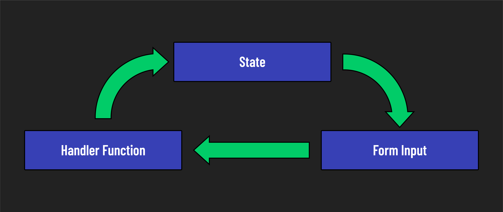
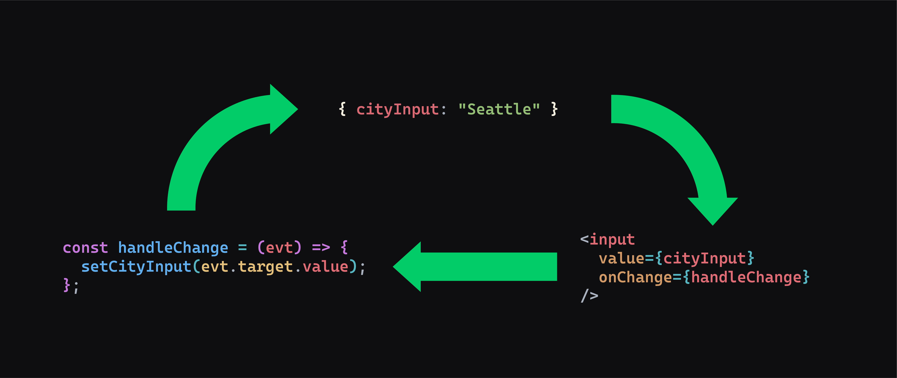

# 

**Learning objective:** By the end of this lesson, students will be able to understand and implement a controlled input in React by correctly setting up state variables, handler functions, and controlled inputs.



## Building a controlled input

All controlled inputs start life as an uncontrolled input. Ours begins as a single input element that prompts the user for the name of a city:

```jsx
// src/App.jsx

import './App.css';

const App = () => {
  return (
    <>
      <label htmlFor="cityInput">City: </label>
      <input id="cityInput" name="cityInput" type="text" />
    </>
  );
};

export default App;
```

Let's turn this into a controlled input by adding the three requirements piece by piece.

### 1. Add state

We'll start with state by importing the `useState()` hook and adding `cityInput` state:

> **What does the useState hook provide for our component?**
>
> The useState hook provides a way to declare state variables in a functional component. It returns an array with the current state value and a function to update that state.

```jsx
// src/App.jsx

// add an import for the useState hook
import { useState } from 'react';

import './App.css';

const App = () => {
  // construct the cityInput state
  const [cityInput, setCityInput] = useState('');

  return (
    <>
      <label htmlFor="cityInput">City: </label>
      <input id="cityInput" name="cityInput" type="text" />
    </>
  );
};

export default App;
```

> **What is the initial value of cityInput, and why?**
>
> The initial value of cityInput is an empty string ''. This represents the initial, empty state of the input before the user enters any data.

### 2. Add an input value tied to state

```jsx
// src/App.jsx

  return (
    <>
      <label htmlFor="cityInput">City: </label>
      <input id="cityInput" name="cityInput" type="text" value={cityInput}/>
    </>
  );
```

The input field's `value` prop is now bound to the `cityInput` state. This binding ensures that the displayed value in the input field always matches the current state, and is updated in real-time as the user types.

> **Why doesn't the input display typed characters initially?**
>
>The input doesn't display typed characters initially because the value prop is set to a state variable that never changes. Without a handler function to update the state, the input remains empty.

### 3. Add a change handler function

```jsx
// src/App.jsx

const App = () => {
  const [cityInput, setCityInput] = useState('');

  const handleChange = (event) => {
    setCityInput(event.target.value);
  };

  return (
    <>
      <label htmlFor="cityInput">City: </label>
      <input 
        id="cityInput"
        name="cityInput"
        type="text"
        value={cityInput}
        onChange={handleChange}
      />
    </>
  );
};
  
```

> **What does `event.target.value` represent in this context?**
>
> `event.target.value` represents the current **value of the input element that triggered the event**. It is used to capture the user's input and update the component's state accordingly.



We've now built a controlled input and have seen each piece at play!

> ♻️ **Repeatable pattern**: While each piece may become more complex in a more complex application, the three fundamental things required to make controlled inputs won't. You'll always need some kind of state, some kind of user input element, and a handler function that sets state inside it.

Here's our final working app component:

```jsx
// src/App.jsx

import { useState } from 'react';

import './App.css';

const App = () => {
  const [cityInput, setCityInput] = useState('');

  const handleChange = (event) => {
    setCityInput(event.target.value);
  };

  return (
    <>
      <label htmlFor="cityInput">City: </label>
      <input
        id="cityInput"
        name="cityInput"
        type="text"
        value={cityInput}
        onChange={handleChange}
      />
    </>
  );
};

export default App;
```
